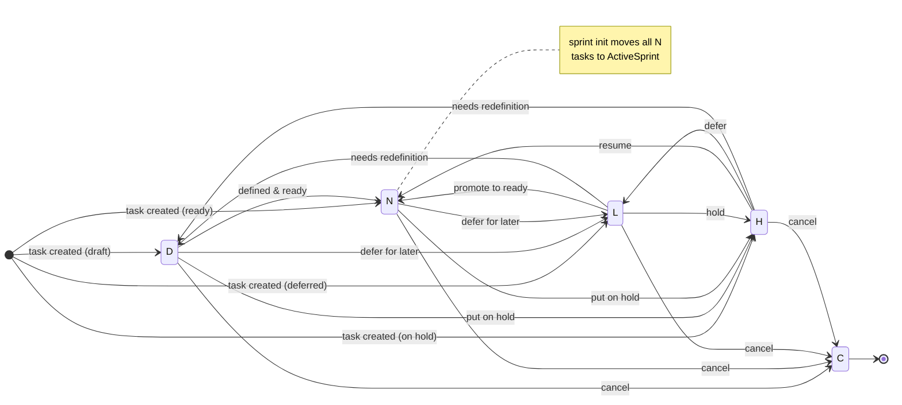
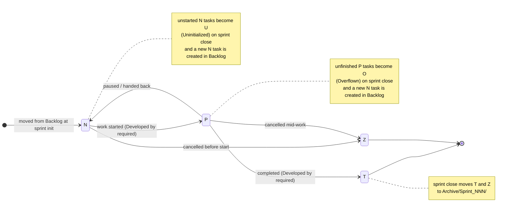

<!-- kk-workspace-version: 1.4.1 -->
# Task project workspace  - Klyte Kanban CLI format

This folder is used to organize all actionable improvement tasks to be done on the project.

Use the `npx kk` CLI tool to manage tasks, sprints, and workspace metadata.

## Project description and notes

This folder contains the taskboard for Addresses mod for Cities: Skylines 2. Future features studies, design docs, and research notes should be placed in the `RefsLibrary/` subfolder. Tasks can refer them as needed via relative paths.

### Building the project

The project can be built using the command line with MSBuild:

```bash
    MSBuild.exe AddressesCS2.sln /p:Configuration=Debug 
```

It will run frontend and backends builds, and also copy the mod files into the game mods folder for testing.

### Self identification e-mail

Shall be an address hosted at @kwyt.com.br. Example: `user@kwyt.com.br`

If you are an AI agent, use your engine name and version as the local part (before the @) to help identify the source of task updates in email notifications.

### After ending a sprint

Additionally to the usual workflow via `npx kk`, manual testing will be required. So every sprint should end with a testing plan to be run by QA, and the results should be documented in the task files and/or in the `RefsLibrary/` as needed.

### `RefsLibrary/` usage guidelines

When adding a new research conetent here, always name the folder that holds all the related files with the pattern `YYYYMMDDHH_descriptive-title/` to ensure chronological ordering and easy reference from tasks. For example, `2024061509_mod-architecture-research/`.

The subfolder `_auxFiles/` contains shared auxiliary files that can help with the research, like the current game decompiled code and other reference materials. These files **cannot** be referenced directly from tasks, but can be used as a source for information to be included in the task files themselves.

## Folder structure

### ActiveSprint/

Tasks currently being worked on in the active sprint. Each task is a markdown file following the naming convention described below.

### Backlog/

Tasks not yet scheduled for a sprint. Organized by priority and status.

### Archive/

Completed or cancelled tasks moved here at the end of each sprint.

### RefsLibrary/

Reference documents, research notes, and design decisions related to the project.

## Task file naming convention

```
X[_epic]_N_AAAA_resume-of-task.md
```

- `X`     — Status letter (see table below)
- `epic`  — Optional epic label: 3-15 lowercase alphanumeric characters
- `N`     — Priority digit: 0 (Very High) - 4 (Very Low)
- `AAAA`  — Unique sequential ID, 4+ zero-padded digits
- `title` — kebab-case description

## Task status reference

| Status | Location | Meaning | Terminal? |
|--------|----------|---------|-----------|
| `N` | Backlog or ActiveSprint | **New** — defined, has DoD, ready to be picked up | No |
| `P` | ActiveSprint | **In Progress** — actively being worked on | No |
| `T` | ActiveSprint → Archive | **Terminated/Completed** — work finished and validated | Yes |
| `Z` | ActiveSprint → Archive | **Cancelled** — abandoned during a sprint | Yes |
| `O` | Archive | **Overflown** — was in-progress when sprint closed; continuation in Backlog | Yes |
| `U` | Archive | **Uninitialized** — never started when sprint closed; continuation in Backlog | Yes |
| `D` | Backlog | **Draft** — still being defined; not ready for a sprint | No |
| `H` | Backlog | **Hold** — intentionally paused, not being actively worked on | No |
| `L` | Backlog | **Left for Later** — ready but intentionally excluded from the next sprint | No |
| `C` | Backlog | **Cancelled** — abandoned before ever reaching a sprint | Yes |

## Status flow — Backlog



## Status flow — Active Sprint



## `kk task update` — JSON to CLI flag mapping

When using `kk task update <id> --from-json <file>`, the JSON fields map to individual CLI flags as shown below.
Run `kk schema task` to see the full JSON schema.

| JSON Field | CLI Flag | Example |
|------------|----------|---------|
| `background` | `--background <text>` | `--background "Context info"` |
| `userStory.role` | `--user-story-role <text>` | `--user-story-role "a developer"` |
| `userStory.want` | `--user-story-want <text>` | `--user-story-want "fast builds"` |
| `userStory.benefit` | `--user-story-benefit <text>` | `--user-story-benefit "save time"` |
| `dor` | `--dor-add <text>` / `--dor-remove <idx>` / `--dor-check <idx>` / `--dor-uncheck <idx>` | `--dor-add "Scope confirmed"` |
| `dod` | `--dod-add <text>` / `--dod-remove <idx>` / `--dod-check <idx>` / `--dod-uncheck <idx>` | `--dod-add "Tests pass"` |
| `implementationNotes` | `--implementation-note <text>` (repeatable) | `--implementation-note "Add handler"` |
| `riskAssessment` | *(JSON-only — no individual CLI flag)* | `--from-json patch.json` |
| `relatedTasks.dependsOn` | `--depends-on <ref>` (repeatable) | `--depends-on "[0042]"` |
| `relatedTasks.isDependentFor` | `--is-dependent-for <ref>` (repeatable) | `--is-dependent-for "[0043]"` |
| `relatedTasks.isRelatedTo` | `--is-related-to <ref>` (repeatable) | `--is-related-to "[0044]"` |
| `relatedTasks.groupsWith` | `--groups-with <ref>` (repeatable) | `--groups-with "[0045]"` |
| `relatedTasks.isParentOf` | `--is-parent-of <ref>` (repeatable) | `--is-parent-of "[0046]"` |
| `relatedTasks.isChildOf` | `--is-child-of <ref>` (repeatable) | `--is-child-of "[0047]"` |
| `relatedTasks.overflownFrom` | *(system-managed — rejected in \`--from-json\`)* | — |
| `relatedTasks.overflownTo` | *(system-managed — rejected in \`--from-json\`)* | — |

> **Note:** `overflownFrom` and `overflownTo` are system-managed and will be rejected if included in a `--from-json` payload.

## Error codes reference

| Code | Description |
|------|-------------|
| `WORKSPACE_NOT_FOUND` | No kk workspace found in the current directory or its parents. |
| `WORKSPACE_CORRUPTED` | The workspace structure is invalid or required files are missing. |
| `TASK_NOT_FOUND` | The specified task ID does not exist in the workspace. |
| `TASK_ARCHIVED` | The task is in the Archive and cannot be modified. |
| `TASK_DUPLICATE_ID` | A task with the same ID already exists. |
| `TASK_TITLE_CONFLICT` | A task with the same slug/title already exists. |
| `INVALID_STATUS` | The given status letter is not a recognized task status. |
| `INVALID_TRANSITION` | The status change is not allowed by the status flow rules. |
| `INVALID_PRIORITY` | The priority value is out of the accepted range (0–4). |
| `DEVELOPER_REQUIRED` | A developer name is required for this status transition. |
| `SPRINT_ALREADY_RUNNING` | A sprint is already active in ActiveSprint/. |
| `NO_SPRINT_RUNNING` | No sprint is currently active. |
| `SPRINT_LIMIT_EXCEEDED` | Maximum sprint number (999) has been reached. |
| `ARCHIVE_EXISTS` | The target archive folder already exists. |
| `EXPECTED_ID_MISMATCH` | The --expected-id value does not match the next available ID. |
| `JSON_PARSE_ERROR` | The input could not be parsed as valid JSON. |
| `JSON_VALIDATION_ERROR` | The JSON structure does not match the expected schema. |
| `HEADING_IN_FREE_TEXT` | Markdown headings are not allowed inside free-text sections. |
| `FILE_WRITE_ERROR` | Could not write to the target file on disk. |
| `CONFIG_INVALID` | The workspace configuration (.kkconfig) is invalid. |
| `EPIC_INVALID_NAME` | The epic name does not meet naming rules (3–15 lowercase alphanumeric). |
| `EPIC_IMMUTABLE` | The epic cannot be changed because the task is in a terminal state. |
| `EPIC_MERGE_CONFLICT` | The target epic already has a task that conflicts with the merge. |
| `TASK_NOT_READY` | The task is not in a state that allows this operation. |
| `MISSING_ARGUMENT` | A required argument or option was not provided. |
| `INVALID_ARGUMENT` |  |
| `DEVELOPER_CONFLICT` | The developer name conflicts with the existing assignment. |
| `DOD_INCOMPLETE` |  |

## Mutable data

- Last task ID: 0016
- Last sprint number: 001
